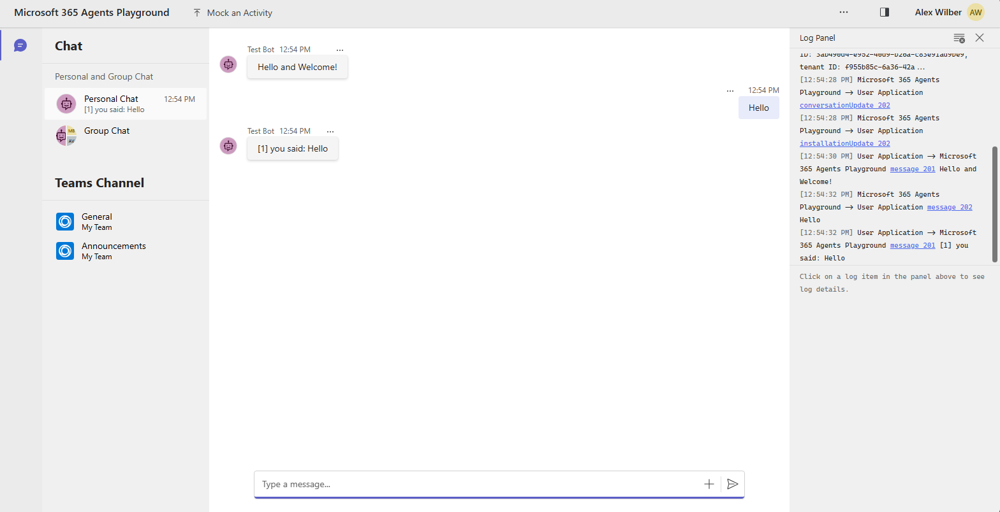

# SharePoint AI Assistant Teams Bot

This Microsoft Teams bot integrates with a FastAPI backend to provide conversational AI assistance with SharePoint capabilities. The bot can handle general chat conversations (like ChatGPT) and specialized SharePoint operations.

## Features

- **💬 General Conversation**: Ask anything like ChatGPT - questions, explanations, coding help, etc.
- **📊 SharePoint Integration**: Manage sites, documents, and lists through natural language
- **📄 File Upload**: Upload documents directly to SharePoint with intelligent destination parsing
- **🔄 Conversation Memory**: Maintains context across messages using thread-based conversations
- **🌐 Multi-language Support**: Built-in support for multiple languages

## Architecture

```
Teams Client ↔ Teams Bot (Node.js/Express) ↔ FastAPI Backend ↔ SharePoint/Microsoft Graph
```

## Setup Instructions

### Prerequisites

- [Node.js](https://nodejs.org/) (versions 18, 20, or 22)
- [Microsoft 365 Agents Toolkit Visual Studio Code Extension](https://aka.ms/teams-toolkit) version 5.0.0+
- FastAPI backend running (your AI assistant with SharePoint integration)

### Backend Configuration

1. **Start your FastAPI backend** first:
   ```bash
   # In your backend directory
   python main_chat.py
   # Should be running on http://localhost:8000
   ```

2. **Configure the bot** to connect to your backend:
   ```bash
   # Copy environment template
   cp .env.example .env
   
   # Edit .env file
   API_URL=http://localhost:8000
   ```

### Running the Teams Bot

1. **Install dependencies**:
   ```bash
   npm install
   ```

2. **Start debugging** in VS Code:
   - Open Microsoft 365 Agents Toolkit panel in VS Code
   - Press F5 to start debugging
   - Select `Debug in Microsoft 365 Agents Playground`

3. **Test the integration**:
   - Send a message: "Hello, how are you?"
   - Try SharePoint commands: "List my SharePoint sites"
   - Upload a file with destination: "Upload to site marketing in Documents"

## Usage Examples

### General Chat
- "Hello, how are you today?"
- "Explain machine learning to me"
- "Help me write a Python script"
- "What's the capital of France?"

### SharePoint Operations
- "Get info for site contoso.sharepoint.com/sites/team"
- "List document libraries in the marketing site"
- "Show me documents in the shared library"
- "Create item in list: abc123 Title: New Project Status: Planning"

### File Upload
Simply attach a file and include destination instructions:
- "Upload to Documents"
- "Site marketing in Projects folder"
- "https://company.sharepoint.com/sites/team in Reports"

**Congratulations**! You now have an AI-powered SharePoint assistant running in Teams:




## What's included in the template

| Folder       | Contents                                            |
| - | - |
| `.vscode`    | VSCode files for debugging                          |
| `appPackage` | Templates for the application manifest        |
| `env`        | Environment files                                   |
| `infra`      | Templates for provisioning Azure resources          |

The following files can be customized and demonstrate an example implementation to get you started.

| File                                 | Contents                                           |
| - | - |
|`teamsBot.ts`| Handles business logics for the echo bot.|
|`index.ts`|`index.ts` is used to setup and configure the echo bot.|

The following are Microsoft 365 Agents Toolkit specific project files. You can [visit a complete guide on Github](https://github.com/OfficeDev/TeamsFx/wiki/Teams-Toolkit-Visual-Studio-Code-v5-Guide#overview) to understand how Microsoft 365 Agents Toolkit works.

| File                                 | Contents                                           |
| - | - |
|`m365agents.yml`|This is the main Microsoft 365 Agents Toolkit project file. The project file defines two primary things:  Properties and configuration Stage definitions. |
|`m365agents.local.yml`|This overrides `m365agents.yml` with actions that enable local execution and debugging.|
|`m365agents.playground.yml`| This overrides `m365agents.yml` with actions that enable local execution and debugging in Microsoft 365 Agents Playground.|

## Extend the Basic Bot template

Following documentation will help you to extend the Basic Bot template.

- [Add or manage the environment](https://learn.microsoft.com/microsoftteams/platform/toolkit/teamsfx-multi-env)
- [Create multi-capability app](https://learn.microsoft.com/microsoftteams/platform/toolkit/add-capability)
- [Add single sign on to your app](https://learn.microsoft.com/microsoftteams/platform/toolkit/add-single-sign-on)
- [Access data in Microsoft Graph](https://learn.microsoft.com/microsoftteams/platform/toolkit/teamsfx-sdk#microsoft-graph-scenarios)
- [Use an existing Microsoft Entra application](https://learn.microsoft.com/microsoftteams/platform/toolkit/use-existing-aad-app)
- [Customize the app manifest](https://learn.microsoft.com/microsoftteams/platform/toolkit/teamsfx-preview-and-customize-app-manifest)
- Host your app in Azure by [provision cloud resources](https://learn.microsoft.com/microsoftteams/platform/toolkit/provision) and [deploy the code to cloud](https://learn.microsoft.com/microsoftteams/platform/toolkit/deploy)
- [Collaborate on app development](https://learn.microsoft.com/microsoftteams/platform/toolkit/teamsfx-collaboration)
- [Set up the CI/CD pipeline](https://learn.microsoft.com/microsoftteams/platform/toolkit/use-cicd-template)
- [Publish the app to your organization or the Microsoft app store](https://learn.microsoft.com/microsoftteams/platform/toolkit/publish)
- [Develop with Microsoft 365 Agents Toolkit CLI](https://aka.ms/teams-toolkit-cli/debug)
- [Preview the app on mobile clients](https://aka.ms/teamsfx-mobile)
